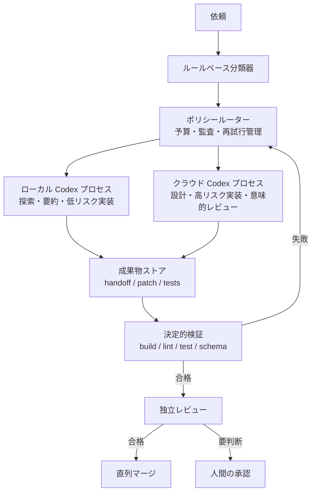

# Codex マルチエージェントとモデル切り替えのハーネス設計

## 質問

Codex を使ってマルチエージェント環境を構成し、作業途中でクラウドモデルとローカル LLM を切り替えることで、品質を維持しながらトークン使用料を削減するには、どのようなハーネスがよいか。

調査時点は 2026-09-22。ここでいう「ハーネス」は、タスクの分類、モデル／プロバイダーへの振り分け、成果物の受け渡し、検証、予算管理、再試行を担う外部オーケストレーターを指す。

## 結論

推奨するのは、**プロバイダーごとに Codex プロセスを分離し、外部ハーネスがチェックポイント単位でルーティングする構成**である。

- 同じプロバイダー内では、Codex の subagent または turn 境界でモデルを使い分ける。
- OpenAI のクラウドモデルと Ollama／LM Studio のローカルモデルをまたぐ場合は、それぞれ別の Codex プロセスとして起動する。
- エージェント間では会話履歴全体を渡さず、目的、制約、判断、差分、テスト結果、未解決点を構造化した handoff にする。
- 探索、ログ要約、定型変換、小さく検証可能な修正をローカルへ寄せ、曖昧な設計、高リスク変更、最終の意味的レビューを強いクラウドモデルへ送る。
- 成否は「一回あたりの単価」ではなく、**検証済みタスク一件あたりの総費用**で評価する。

マルチエージェント化そのものは節約策ではない。公式ドキュメントも、同等の単一エージェント実行よりトークンを多く使う場合があると注意している。節約は、安価なモデルへの適切な委譲、短い handoff、決定的な検証、早い打ち切りによって生まれる。

## 推奨アーキテクチャ



プロバイダー境界をプロセス境界にするのは、Codex の公式機能で subagent ごとの `model` と `model_reasoning_effort` は設定できる一方、同一の subagent tree 内で親を OpenAI、子を Ollama／LM Studio のように混在させられるという保証が確認できなかったためである。これは公式仕様の明記ではなく、現状の仕様から導いた保守的な設計判断である。

## Codex で確認できた機能

### Subagent

Codex の custom agent は、ユーザー単位の `~/.codex/agents/` またはプロジェクト内の `.codex/agents/` に定義でき、agent ごとに `model` と `model_reasoning_effort` を指定できる。未指定なら親の設定を継承する。読み取り専用 agent を探索やレビューへ割り当て、書き込み agent の数を絞る構成が安全である。

### ローカルモデル

CLI の OSS モードは Ollama と LM Studio を利用できる。実行時に `--oss` と `--local-provider ollama|lmstudio` を指定する。独自の OpenAI 互換サーバーやプロキシを使う場合、Codex の custom model provider が現在使う wire API は Responses API であるため、`/v1/responses`、ストリーミング、tool call を実装しているか確認が必要になる。Chat Completions 互換だけでは不十分な可能性がある。

### 自動化インターフェース

最初の PoC には `codex exec` が適している。非対話実行、JSONL イベント、出力 JSON Schema、最終出力ファイルを利用でき、外部ハーネスから扱いやすい。より細かな turn 制御、履歴、承認、ストリーミングが必要になった段階で SDK または App Server に移行する。

App Server では `turn/start` に model と reasoning effort を指定できる。一方、進行中の turn を steer するときには model を変更できない。したがって、モデル切り替えは任意の瞬間ではなく、**turn または checkpoint の境界**で行う。別モデルで thread を resume する機能はあるが、モデル変更を知らせる一時的な指示が追加されるため、再現性が重要な処理では明示的な handoff を優先する。

## ルーティング方針

| タスク | 既定の実行先 | 昇格条件 |
| --- | --- | --- |
| format、build、lint、test、schema 検証 | LLM を使わない | 判定不能または環境障害 |
| リポジトリ探索、検索、ログ要約、分類 | ローカル・読み取り専用 | 根拠が競合、コンテキスト超過 |
| 受け入れ条件が明確な小規模修正 | ローカル・隔離 worktree | テスト失敗、範囲逸脱、同じ誤りの反復 |
| 曖昧な要件、横断設計、大規模リファクタリング | 強いクラウドモデル | 必要なら人間へ確認 |
| 認証、権限、暗号、データ移行、削除 | 強いクラウドモデル＋人間の承認 | 常に慎重側へ倒す |
| 最終の意味的レビュー | 実装者と独立したモデル／コンテキスト | 根拠不足、挙動の不一致 |

ルーターは、リスク、曖昧さ、変更範囲、テスト可能性、機密性をまずルールで分類する。分類自体に高価な LLM を常用すると節約分を失うため、ファイルパス、変更行数、キーワード、テストの有無など、観測可能な特徴を優先する。

標準の再試行方針は次の程度に抑える。

1. ローカルモデルで一度実行する。
2. JSON／tool call の形式だけが壊れていれば、同じモデルで修復を一度行う。
3. テスト失敗、schema 不正の反復、存在しない tool の呼び出し、想定外ファイルへの変更、判断を要する不確実性があればクラウドへ昇格する。
4. 高リスク領域や不可逆操作は、モデルの自己判定だけで続行せず人間へ渡す。

## Checkpoint と handoff

モデルを切り替えられる地点を固定する。

- C0: タスク分類済み
- C1: 計画と受け入れ条件が確定
- C2: patch と自己検査結果が生成済み
- C3: build／lint／test が合格
- C4: 独立した意味的レビューが合格

handoff は最低限、次を持つ。

```yaml
task_id: ...
objective: ...
acceptance_criteria: [...]
base_sha: ...
owned_paths: [...]
constraints: [...]
decisions:
  - decision: ...
    reason: ...
evidence: [file:line または artifact reference]
patch_ref: ...
test_results:
  - command: ...
    exit_code: 0
    log_ref: ...
unresolved: [...]
next_action: ...
producer:
  provider: ...
  model: ...
budget:
  input_tokens: 0
  cached_tokens: 0
  output_tokens: 0
```

全文 transcript、巨大なログ、既に読めるファイル本文は渡さず、artifact reference と要約を渡す。強いモデルが前段の誤りを無批判に継承しないよう、観測事実と判断を別フィールドにする。

## 最小 PoC

最初は SDK や常駐サーバーを導入せず、外部スクリプトから二つの `codex exec` を呼び分ける。

```powershell
$CloudModel = $env:CODEX_CLOUD_MODEL
if (-not $CloudModel) { throw 'Set CODEX_CLOUD_MODEL before running this PoC.' }

codex exec --oss --local-provider ollama -m gpt-oss:20b `
  --sandbox read-only --json `
  --output-schema handoff.schema.json `
  --output-last-message handoff.json `
  'Read the repository and return a scoped implementation brief using the handoff schema.'

codex exec -m $CloudModel `
  --sandbox read-only --json `
  --output-schema verdict.schema.json `
  --output-last-message verdict.json `
  'Read ./handoff.json, review the brief and evidence, then decide the next action.'
```

実行前に `CODEX_CLOUD_MODEL`、`handoff.schema.json`、`verdict.schema.json` を用意する。この例ではローカル探索の最終出力を `handoff.json` に保存し、クラウド側が明示的に読み直す。実運用ではプロンプト文字列だけでなく、タスク JSON、対象 worktree、許可パス、時間上限、トークン上限、成果物ディレクトリを一つの job として管理する。`codex exec --json` の token usage を保存し、クラウドへの昇格率まで追跡する。

概算費用は次で比較する。

```text
期待費用 = ローカル実行費
         + P(ローカル失敗) × (再試行費 + クラウド昇格費)
         + 検証費
```

ローカルモデルの成功率が低く、修復と再読込が増えると、単価が安くても総費用と待ち時間は悪化する。

## ローカル実行基盤

Windows での初期検証は次の順が扱いやすい。

1. **Ollama** — CLI 中心で最短の PoC。まず直列実行で tool call の安定性を測る。
2. **LM Studio** — GUI によるモデル管理、メモリ見積り、並列実行や別マシン化を試す段階で比較する。
3. **vLLM 等** — Linux の専用 GPU サーバーへ集約し、高スループットが必要になってから検討する。

基準モデル候補の `gpt-oss-20b` は、公式情報では 21B total／3.6B active、131,072 context、function calling、structured outputs、Responses API に対応する。約 16 GB のメモリで動くという案内はモデル本体の目安であり、長い context の KV cache、ランタイム、OS、複数 worker の分を含む快適動作条件ではない。実機計測を前提にする。

Ollama は coding tool 用に少なくとも 64K context を推奨している。LM Studio も長い context を勧めているが、最初から最大値にせず、32K、64K、128K と concurrency 1、2、4 の組み合わせを実測する。

## 評価方法

一般的な会話ベンチマークではなく、実際の過去タスクを匿名化して 20〜50 件ほど使う。各構成を最低 3 回実行し、runtime、モデル版、量子化、context、sampling を固定する。

記録する主な指標は次のとおり。

- test 合格率、patch 適用率、最終的な受け入れ率
- tool 選択、引数、schema の正確さ
- 存在しない tool の呼び出し率と tool error からの回復率
- turn 数、time to first token、tokens/sec、p50／p95 所要時間
- VRAM／RAM、queue 時間、OOM 率
- クラウドへの昇格率
- 検証済みタスク一件あたりの費用

品質ゲートに達した構成の中から最安のものを採用する。たとえば test 合格率と tool-call 成功率が基準以上という制約を先に置き、その後で費用を比較する。

## 並列書き込みと安全性

- writer ごとに専用の branch／worktree を与え、所有パスを lease する。
- 統合は一つの merge manager が直列に行い、マージ後に影響範囲の test を再実行する。
- 探索、triage、要約、レビューは並列化しやすいが、同じファイルへの同時書き込みは避ける。
- local worker にクラウド用 API key や不要な credential を渡さない。
- network、web、不要な MCP server は既定で無効にし、必要な job だけ許可する。
- リポジトリ内の文書や tool output も prompt injection を含み得る入力として扱う。
- sandbox と許可パスはプロンプトではなく、ハーネス側の実行制約として強制する。

ローカルで動くことは、自動的に offline、安全、無漏洩を意味しない。ランタイムの通信、MCP、ログ保存先、credential 継承を個別に確認する必要がある。

## 導入段階

1. **Phase 0 — 計測**: 現在の単一 agent の成功率、tokens、時間、費用を記録する。
2. **Phase 1 — 読み取り専用委譲**: 探索、要約、triage だけをローカル化する。
3. **Phase 2 — 小規模実装**: 明確な test がある機械的変更を隔離 worktree でローカルへ任せる。
4. **Phase 3 — App Server／SDK**: turn 制御、履歴、承認、ストリーミングが必要になった時点で移行する。
5. **Phase 4 — 並列化**: 単一 worker の品質とメモリ特性を確認した後、読み取り系から concurrency を増やす。

## 根拠

- [Codex subagents](https://learn.chatgpt.com/docs/agent-configuration/subagents) — custom agent、model／reasoning effort、継承、並列実行、トークン増加への注意。
- [Codex advanced configuration](https://learn.chatgpt.com/docs/config-file/config-advanced) と [configuration reference](https://learn.chatgpt.com/docs/config-file/config-reference) — local provider、custom model provider、設定項目。
- [Codex non-interactive mode](https://learn.chatgpt.com/docs/non-interactive-mode) — `codex exec`、JSONL、output schema。
- [Codex App Server](https://learn.chatgpt.com/docs/app-server) — turn、thread、model 切り替え、usage 情報。
- [Codex SDK](https://learn.chatgpt.com/docs/codex-sdk) — 自動化用 SDK の位置づけ。
- [Codex as a platform](https://developers.openai.com/blog/codex-as-a-platform) — harness と context compaction の重要性。
- [OpenAI gpt-oss-20b](https://developers.openai.com/api/docs/models/gpt-oss-20b) — モデル仕様。
- [LM Studio の Codex 連携](https://lmstudio.ai/docs/integrations/codex) と [tool use](https://lmstudio.ai/docs/developer/openai-compat/tools) — Responses API、tool use、context。
- [Ollama launch](https://ollama.com/blog/launch) — Codex 連携と context の推奨。

## 限界・未解決点

- 同一の native subagent tree で異なる provider を混在できないと断定する公式記述は確認できていない。プロセス分離は、未保証の挙動に依存しないための設計判断である。
- App Server の一部 transport は実験的であり、更新で protocol が変わる可能性がある。導入初期はローカル stdio または `codex exec` を優先する。
- ローカル LLM の実効品質は、GPU／RAM、量子化、context、runtime、並列数、対象リポジトリで大きく変わる。
- モデル名、価格、上限、推奨 hardware は変動するため、固定値を運用判断の唯一の根拠にしない。
- 実際の GPU／RAM 構成と過去タスク分布が未確認なので、最適な context 長、並列数、昇格閾値はベンチマーク後に決める必要がある。

## 関連リンク

- [[wiki/analyses/codex-app-server-overview|Codex app-server の概要と使いどころ]]
- [[wiki/index|LLM Wiki Index]]
